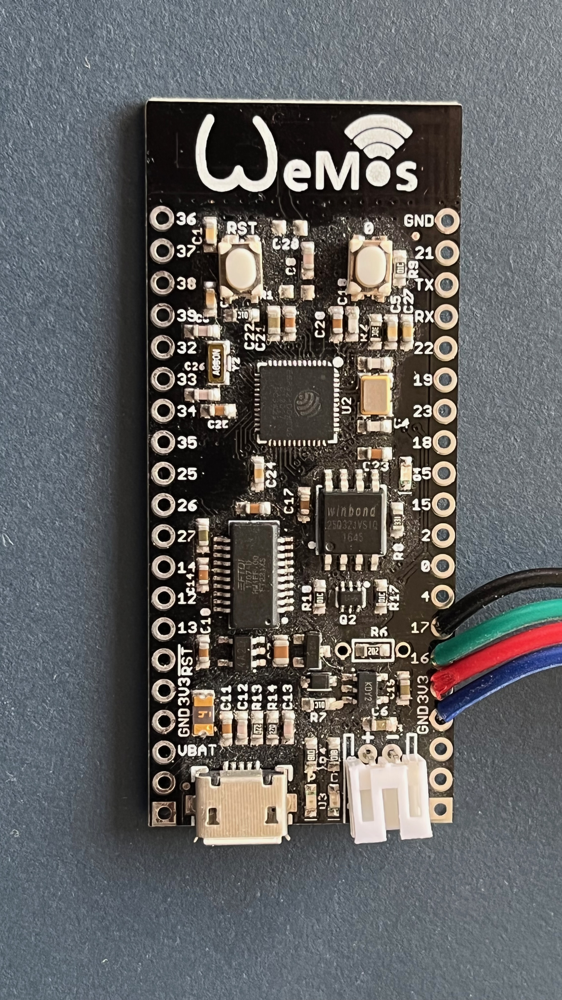
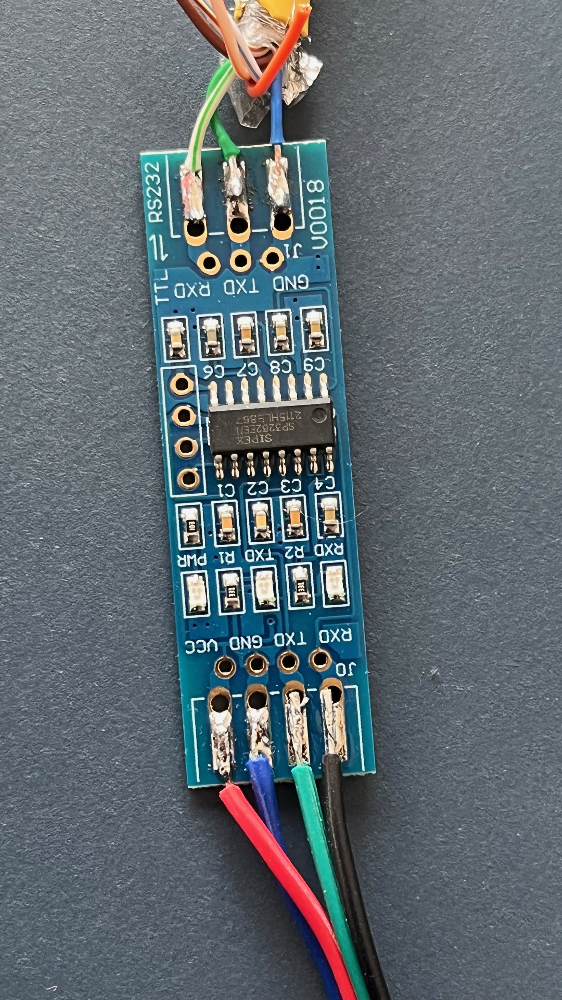
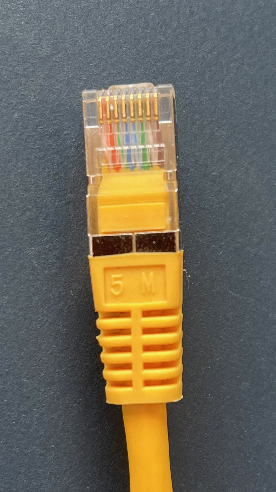

# PYTES E-BOX 48100R to MQTT 

This application runs on an ESP32 with an RS232 level shifter attached to get battery details from an E-Box and provide them as MQTTT topics.

Ther are also Homeassitant MQTT discovery topics implemented. So Devices show up in Homeassistant automatically.

## Disclaimer

This is an hobby project.

Everbody who want's to help is welcome.

You need to know ESP32 PlatformIO and what an level shifter is to be successfull!

You need to know MQTT and Homeassistant!

If you are unfamiliar with the stuff you will get frustrated.

## Why?

I want to see Cell voltages.

## Focus of this Project

Provide info for solar hobbyists.

## Hardware connection

Serial 2 is used on ESP 32

    - Pin: 16 RXD2
    - Pin: 17 TXD2

It has to be connected via 3.3V to RS232C level shifter to Console port on E-BOX:

    - RJ45 Pin: 3 TXD
    - RJ45 Pin: 4 GND
    - RJ45 Pin: 6 RXD

like so:

    - ESP32 Pin: 16 RXD2 ------ level shifter ------ RJ45-Cable-Connector Pin: 3 TXD
    - ESP32 Pin: 17 TXD2 ------ level shifter ------ RJ45-Cable-Connector Pin: 6 RXD
    - ESP32 PIN:     GND ------ level shifter ------ RJ45-Cable-Connector Pin: 4 GND
    - ESP32 PIN:    3.3V ------ level shifter

If it's not workin just swap RXD and TXD on one side.
My level shifter swaps RXD and TXT by itself. This ended in brain fuck.

Here some Pictures:

## WiFi

At first start, there is no WiFi config. Just join "PYTES-E-BOX-48100-R" and connect to "192.168.4.1" via browser.
If you are lucky Captive Portal works and you get the config page popped up automatically.

## Is there a detailed Info?

maybe later ;-)

## Sensor list from Homeassistant (2 rack batteries system)
    sensor.pytes_bat_1_1_base_state
    sensor.pytes_bat_1_1_capacity
    sensor.pytes_bat_1_1_cell
    sensor.pytes_bat_1_1_coulomb
    sensor.pytes_bat_1_1_current
    sensor.pytes_bat_1_1_current_state
    sensor.pytes_bat_1_1_temperature
    sensor.pytes_bat_1_1_temperature_state
    sensor.pytes_bat_1_1_volt
    sensor.pytes_bat_1_1_voltage_state
    sensor.pytes_bat_1_2_base_state
    sensor.pytes_bat_1_2_capacity
    sensor.pytes_bat_1_2_cell
    sensor.pytes_bat_1_2_coulomb
    sensor.pytes_bat_1_2_current
    sensor.pytes_bat_1_2_current_state
    sensor.pytes_bat_1_2_temperature
    sensor.pytes_bat_1_2_temperature_state
    sensor.pytes_bat_1_2_volt
    sensor.pytes_bat_1_2_voltage_state
    sensor.pytes_bat_1_3_base_state
    sensor.pytes_bat_1_3_capacity
    sensor.pytes_bat_1_3_cell
    sensor.pytes_bat_1_3_coulomb
    sensor.pytes_bat_1_3_current
    sensor.pytes_bat_1_3_current_state
    sensor.pytes_bat_1_3_temperature
    sensor.pytes_bat_1_3_temperature_state
    sensor.pytes_bat_1_3_volt
    sensor.pytes_bat_1_3_voltage_state
    sensor.pytes_bat_1_4_base_state
    sensor.pytes_bat_1_4_capacity
    sensor.pytes_bat_1_4_cell
    sensor.pytes_bat_1_4_coulomb
    sensor.pytes_bat_1_4_current
    sensor.pytes_bat_1_4_current_state
    sensor.pytes_bat_1_4_temperature
    sensor.pytes_bat_1_4_temperature_state
    sensor.pytes_bat_1_4_volt
    sensor.pytes_bat_1_4_voltage_state
    sensor.pytes_bat_1_5_base_state
    sensor.pytes_bat_1_5_capacity
    sensor.pytes_bat_1_5_cell
    sensor.pytes_bat_1_5_coulomb
    sensor.pytes_bat_1_5_current
    sensor.pytes_bat_1_5_current_state
    sensor.pytes_bat_1_5_temperature
    sensor.pytes_bat_1_5_temperature_state
    sensor.pytes_bat_1_5_volt
    sensor.pytes_bat_1_5_voltage_state
    sensor.pytes_bat_1_6_base_state
    sensor.pytes_bat_1_6_capacity
    sensor.pytes_bat_1_6_cell
    sensor.pytes_bat_1_6_coulomb
    sensor.pytes_bat_1_6_current
    sensor.pytes_bat_1_6_current_state
    sensor.pytes_bat_1_6_temperature
    sensor.pytes_bat_1_6_temperature_state
    sensor.pytes_bat_1_6_volt
    sensor.pytes_bat_1_6_voltage_state
    sensor.pytes_bat_1_7_base_state
    sensor.pytes_bat_1_7_capacity
    sensor.pytes_bat_1_7_cell
    sensor.pytes_bat_1_7_coulomb
    sensor.pytes_bat_1_7_current
    sensor.pytes_bat_1_7_current_state
    sensor.pytes_bat_1_7_temperature
    sensor.pytes_bat_1_7_temperature_state
    sensor.pytes_bat_1_7_volt
    sensor.pytes_bat_1_7_voltage_state
    sensor.pytes_bat_1_8_base_state
    sensor.pytes_bat_1_8_capacity
    sensor.pytes_bat_1_8_cell
    sensor.pytes_bat_1_8_coulomb
    sensor.pytes_bat_1_8_current
    sensor.pytes_bat_1_8_current_state
    sensor.pytes_bat_1_8_temperature
    sensor.pytes_bat_1_8_temperature_state
    sensor.pytes_bat_1_8_volt
    sensor.pytes_bat_1_8_voltage_state
    sensor.pytes_bat_1_9_base_state
    sensor.pytes_bat_1_9_capacity
    sensor.pytes_bat_1_9_cell
    sensor.pytes_bat_1_9_coulomb
    sensor.pytes_bat_1_9_current
    sensor.pytes_bat_1_9_current_state
    sensor.pytes_bat_1_9_temperature
    sensor.pytes_bat_1_9_temperature_state
    sensor.pytes_bat_1_9_volt
    sensor.pytes_bat_1_9_voltage_state
    sensor.pytes_bat_1_10_capacity
    sensor.pytes_bat_1_10_cell
    sensor.pytes_bat_1_10_coulomb
    sensor.pytes_bat_1_10_current
    sensor.pytes_bat_1_10_current_state
    sensor.pytes_bat_1_10_temperature
    sensor.pytes_bat_1_10_temperature_state
    sensor.pytes_bat_1_10_volt
    sensor.pytes_bat_1_10_voltage_state
    sensor.pytes_bat_1_11_base_state
    sensor.pytes_bat_1_11_capacity
    sensor.pytes_bat_1_11_cell
    sensor.pytes_bat_1_11_coulomb
    sensor.pytes_bat_1_11_current
    sensor.pytes_bat_1_11_current_state
    sensor.pytes_bat_1_11_temperature
    sensor.pytes_bat_1_11_temperature_state
    sensor.pytes_bat_1_11_volt
    sensor.pytes_bat_1_11_voltage_state
    sensor.pytes_bat_1_12_base_state
    sensor.pytes_bat_1_12_capacity
    sensor.pytes_bat_1_12_cell
    sensor.pytes_bat_1_12_coulomb
    sensor.pytes_bat_1_12_current
    sensor.pytes_bat_1_12_current_state
    sensor.pytes_bat_1_12_temperature
    sensor.pytes_bat_1_12_temperature_state
    sensor.pytes_bat_1_12_volt
    sensor.pytes_bat_1_12_voltage_state
    sensor.pytes_bat_1_13_base_state
    sensor.pytes_bat_1_13_capacity
    sensor.pytes_bat_1_13_cell
    sensor.pytes_bat_1_13_coulomb
    sensor.pytes_bat_1_13_current
    sensor.pytes_bat_1_13_current_state
    sensor.pytes_bat_1_13_temperature
    sensor.pytes_bat_1_13_temperature_state
    sensor.pytes_bat_1_13_volt
    sensor.pytes_bat_1_13_voltage_state
    sensor.pytes_bat_1_14_base_state
    sensor.pytes_bat_1_14_capacity
    sensor.pytes_bat_1_14_cell
    sensor.pytes_bat_1_14_coulomb
    sensor.pytes_bat_1_14_current
    sensor.pytes_bat_1_14_current_state
    sensor.pytes_bat_1_14_temperature
    sensor.pytes_bat_1_14_temperature_state
    sensor.pytes_bat_1_14_volt
    sensor.pytes_bat_1_14_voltage_state
    sensor.pytes_bat_1_15_base_state
    sensor.pytes_bat_1_15_capacity
    sensor.pytes_bat_1_15_cell
    sensor.pytes_bat_1_15_coulomb
    sensor.pytes_bat_1_15_current
    sensor.pytes_bat_1_15_current_state
    sensor.pytes_bat_1_15_temperature
    sensor.pytes_bat_1_15_temperature_state
    sensor.pytes_bat_1_15_volt
    sensor.pytes_bat_1_15_voltage_state
    sensor.pytes_bat_1_16_base_state
    sensor.pytes_bat_1_16_capacity
    sensor.pytes_bat_1_16_cell
    sensor.pytes_bat_1_16_coulomb
    sensor.pytes_bat_1_16_current
    sensor.pytes_bat_1_16_current_state
    sensor.pytes_bat_1_16_temperature
    sensor.pytes_bat_1_16_temperature_state
    sensor.pytes_bat_1_16_volt
    sensor.pytes_bat_1_16_voltage_state
    sensor.pytes_bat_2_1_base_state
    sensor.pytes_bat_2_1_capacity
    sensor.pytes_bat_2_1_cell
    sensor.pytes_bat_2_1_coulomb
    sensor.pytes_bat_2_1_current
    sensor.pytes_bat_2_1_current_state
    sensor.pytes_bat_2_1_temperature
    sensor.pytes_bat_2_1_temperature_state
    sensor.pytes_bat_2_1_volt
    sensor.pytes_bat_2_1_voltage_state
    sensor.pytes_bat_2_2_base_state
    sensor.pytes_bat_2_2_capacity
    sensor.pytes_bat_2_2_cell
    sensor.pytes_bat_2_2_coulomb
    sensor.pytes_bat_2_2_current
    sensor.pytes_bat_2_2_current_state
    sensor.pytes_bat_2_2_temperature
    sensor.pytes_bat_2_2_temperature_state
    sensor.pytes_bat_2_2_volt
    sensor.pytes_bat_2_2_voltage_state
    sensor.pytes_bat_2_3_base_state
    sensor.pytes_bat_2_3_capacity
    sensor.pytes_bat_2_3_cell
    sensor.pytes_bat_2_3_coulomb
    sensor.pytes_bat_2_3_current
    sensor.pytes_bat_2_3_current_state
    sensor.pytes_bat_2_3_temperature
    sensor.pytes_bat_2_3_temperature_state
    sensor.pytes_bat_2_3_volt
    sensor.pytes_bat_2_3_voltage_state
    sensor.pytes_bat_2_4_base_state
    sensor.pytes_bat_2_4_capacity
    sensor.pytes_bat_2_4_cell
    sensor.pytes_bat_2_4_coulomb
    sensor.pytes_bat_2_4_current
    sensor.pytes_bat_2_4_current_state
    sensor.pytes_bat_2_4_temperature
    sensor.pytes_bat_2_4_temperature_state
    sensor.pytes_bat_2_4_volt
    sensor.pytes_bat_2_4_voltage_state
    sensor.pytes_bat_2_5_base_state
    sensor.pytes_bat_2_5_capacity
    sensor.pytes_bat_2_5_cell
    sensor.pytes_bat_2_5_coulomb
    sensor.pytes_bat_2_5_current
    sensor.pytes_bat_2_5_current_state
    sensor.pytes_bat_2_5_temperature
    sensor.pytes_bat_2_5_temperature_state
    sensor.pytes_bat_2_5_volt
    sensor.pytes_bat_2_5_voltage_state
    sensor.pytes_bat_2_6_base_state
    sensor.pytes_bat_2_6_capacity
    sensor.pytes_bat_2_6_cell
    sensor.pytes_bat_2_6_coulomb
    sensor.pytes_bat_2_6_current
    sensor.pytes_bat_2_6_current_state
    sensor.pytes_bat_2_6_temperature
    sensor.pytes_bat_2_6_temperature_state
    sensor.pytes_bat_2_6_volt
    sensor.pytes_bat_2_6_voltage_state
    sensor.pytes_bat_2_7_base_state
    sensor.pytes_bat_2_7_capacity
    sensor.pytes_bat_2_7_cell
    sensor.pytes_bat_2_7_coulomb
    sensor.pytes_bat_2_7_current
    sensor.pytes_bat_2_7_current_state
    sensor.pytes_bat_2_7_temperature
    sensor.pytes_bat_2_7_temperature_state
    sensor.pytes_bat_2_7_volt
    sensor.pytes_bat_2_7_voltage_state
    sensor.pytes_bat_2_8_base_state
    sensor.pytes_bat_2_8_capacity
    sensor.pytes_bat_2_8_cell
    sensor.pytes_bat_2_8_coulomb
    sensor.pytes_bat_2_8_current
    sensor.pytes_bat_2_8_current_state
    sensor.pytes_bat_2_8_temperature
    sensor.pytes_bat_2_8_temperature_state
    sensor.pytes_bat_2_8_volt
    sensor.pytes_bat_2_8_voltage_state
    sensor.pytes_bat_2_9_base_state
    sensor.pytes_bat_2_9_capacity
    sensor.pytes_bat_2_9_cell
    sensor.pytes_bat_2_9_coulomb
    sensor.pytes_bat_2_9_current
    sensor.pytes_bat_2_9_current_state
    sensor.pytes_bat_2_9_temperature
    sensor.pytes_bat_2_9_temperature_state
    sensor.pytes_bat_2_9_volt
    sensor.pytes_bat_2_9_voltage_state
    sensor.pytes_bat_2_10_base_state
    sensor.pytes_bat_2_10_capacity
    sensor.pytes_bat_2_10_cell
    sensor.pytes_bat_2_10_coulomb
    sensor.pytes_bat_2_10_current
    sensor.pytes_bat_2_10_current_state
    sensor.pytes_bat_2_10_temperature
    sensor.pytes_bat_2_10_temperature_state
    sensor.pytes_bat_2_10_volt
    sensor.pytes_bat_2_10_voltage_state
    sensor.pytes_bat_2_11_base_state
    sensor.pytes_bat_2_11_capacity
    sensor.pytes_bat_2_11_cell
    sensor.pytes_bat_2_11_coulomb
    sensor.pytes_bat_2_11_current
    sensor.pytes_bat_2_11_current_state
    sensor.pytes_bat_2_11_temperature
    sensor.pytes_bat_2_11_temperature_state
    sensor.pytes_bat_2_11_volt
    sensor.pytes_bat_2_11_voltage_state
    sensor.pytes_bat_2_12_base_state
    sensor.pytes_bat_2_12_capacity
    sensor.pytes_bat_2_12_cell
    sensor.pytes_bat_2_12_coulomb
    sensor.pytes_bat_2_12_current
    sensor.pytes_bat_2_12_current_state
    sensor.pytes_bat_2_12_temperature
    sensor.pytes_bat_2_12_temperature_state
    sensor.pytes_bat_2_12_volt
    sensor.pytes_bat_2_12_voltage_state
    sensor.pytes_bat_2_13_base_state
    sensor.pytes_bat_2_13_capacity
    sensor.pytes_bat_2_13_cell
    sensor.pytes_bat_2_13_coulomb
    sensor.pytes_bat_2_13_current
    sensor.pytes_bat_2_13_current_state
    sensor.pytes_bat_2_13_temperature
    sensor.pytes_bat_2_13_temperature_state
    sensor.pytes_bat_2_13_volt
    sensor.pytes_bat_2_13_voltage_state
    sensor.pytes_bat_2_14_base_state
    sensor.pytes_bat_2_14_capacity
    sensor.pytes_bat_2_14_cell
    sensor.pytes_bat_2_14_coulomb
    sensor.pytes_bat_2_14_current
    sensor.pytes_bat_2_14_current_state
    sensor.pytes_bat_2_14_temperature
    sensor.pytes_bat_2_14_temperature_state
    sensor.pytes_bat_2_14_volt
    sensor.pytes_bat_2_14_voltage_state
    sensor.pytes_bat_2_15_base_state
    sensor.pytes_bat_2_15_capacity
    sensor.pytes_bat_2_15_cell
    sensor.pytes_bat_2_15_coulomb
    sensor.pytes_bat_2_15_current
    sensor.pytes_bat_2_15_current_state
    sensor.pytes_bat_2_15_temperature
    sensor.pytes_bat_2_15_temperature_state
    sensor.pytes_bat_2_15_volt
    sensor.pytes_bat_2_15_voltage_state
    sensor.pytes_bat_2_16_base_state
    sensor.pytes_bat_2_16_capacity
    sensor.pytes_bat_2_16_cell
    sensor.pytes_bat_2_16_coulomb
    sensor.pytes_bat_2_16_current
    sensor.pytes_bat_2_16_current_state
    sensor.pytes_bat_2_16_temperature
    sensor.pytes_bat_2_16_temperature_state
    sensor.pytes_bat_2_16_volt
    sensor.pytes_bat_2_16_voltage_state
    sensor.pytes_info_1_barcode
    sensor.pytes_info_1_board_version
    sensor.pytes_info_1_boot_version
    sensor.pytes_info_1_cell_number
    sensor.pytes_info_1_comm_version
    sensor.pytes_info_1_console_port_rate
    sensor.pytes_info_1_device_name
    sensor.pytes_info_1_main_soft_version
    sensor.pytes_info_1_manufacturer
    sensor.pytes_info_1_max_charge_curr
    sensor.pytes_info_1_max_dischg_curr
    sensor.pytes_info_1_release_date
    sensor.pytes_info_1_soft_version
    sensor.pytes_info_1_specification
    sensor.pytes_info_2_barcode
    sensor.pytes_info_2_board_version
    sensor.pytes_info_2_boot_version
    sensor.pytes_info_2_cell_number
    sensor.pytes_info_2_comm_version
    sensor.pytes_info_2_console_port_rate
    sensor.pytes_info_2_device_name
    sensor.pytes_info_2_main_soft_version
    sensor.pytes_info_2_manufacturer
    sensor.pytes_info_2_max_charge_curr
    sensor.pytes_info_2_max_dischg_curr
    sensor.pytes_info_2_release_date
    sensor.pytes_info_2_soft_version
    sensor.pytes_info_2_specification
    sensor.pytes_pwr_1_basic_status
    sensor.pytes_pwr_1_bat_events
    sensor.pytes_pwr_1_charge_seconds
    sensor.pytes_pwr_1_charge_times
    sensor.pytes_pwr_1_coulomb
    sensor.pytes_pwr_1_coulomb_status
    sensor.pytes_pwr_1_current
    sensor.pytes_pwr_1_current_status
    sensor.pytes_pwr_1_discharge_seconds
    sensor.pytes_pwr_1_heater_status
    sensor.pytes_pwr_1_max_voltage
    sensor.pytes_pwr_1_power_events
    sensor.pytes_pwr_1_protect_ena
    sensor.pytes_pwr_1_real_coulomb
    sensor.pytes_pwr_1_state_of_health_status
    sensor.pytes_pwr_1_system_fault
    sensor.pytes_pwr_1_temperature
    sensor.pytes_pwr_1_temperature_status
    sensor.pytes_pwr_1_total_coulomb
    sensor.pytes_pwr_1_volt_status
    sensor.pytes_pwr_1_voltage
    sensor.pytes_pwr_2_basic_status
    sensor.pytes_pwr_2_bat_events
    sensor.pytes_pwr_2_charge_seconds
    sensor.pytes_pwr_2_charge_times
    sensor.pytes_pwr_2_coulomb
    sensor.pytes_pwr_2_coulomb_status
    sensor.pytes_pwr_2_current
    sensor.pytes_pwr_2_current_status
    sensor.pytes_pwr_2_discharge_seconds
    sensor.pytes_pwr_2_heater_status
    sensor.pytes_pwr_2_max_voltage
    sensor.pytes_pwr_2_power_events
    sensor.pytes_pwr_2_protect_ena
    sensor.pytes_pwr_2_real_coulomb
    sensor.pytes_pwr_2_state_of_health_status
    sensor.pytes_pwr_2_system_fault
    sensor.pytes_pwr_2_temperature
    sensor.pytes_pwr_2_temperature_status
    sensor.pytes_pwr_2_total_coulomb
    sensor.pytes_pwr_2_usag
    sensor.pytes_pwr_2_volt_status
    sensor.pytes_pwr_2_voltage
    sensor.pytes_pwrsys_0_average_temperature
    sensor.pytes_pwrsys_0_average_voltage
    sensor.pytes_pwrsys_0_highest_temperature
    sensor.pytes_pwrsys_0_highest_voltage
    sensor.pytes_pwrsys_0_lowest_temperature
    sensor.pytes_pwrsys_0_lowest_voltage
    sensor.pytes_pwrsys_0_present_num
    sensor.pytes_pwrsys_0_recommend_chg_current
    sensor.pytes_pwrsys_0_recommend_chg_voltage
    sensor.pytes_pwrsys_0_recommend_dsg_current
    sensor.pytes_pwrsys_0_recommend_dsg_voltage
    sensor.pytes_pwrsys_0_sleep_num
    sensor.pytes_pwrsys_0_system_curr
    sensor.pytes_pwrsys_0_system_fcc
    sensor.pytes_pwrsys_0_system_rc
    sensor.pytes_pwrsys_0_system_soc
    sensor.pytes_pwrsys_0_system_soh
    sensor.pytes_pwrsys_0_system_volt
    sensor.pytes_pwrsys_0_total_num
